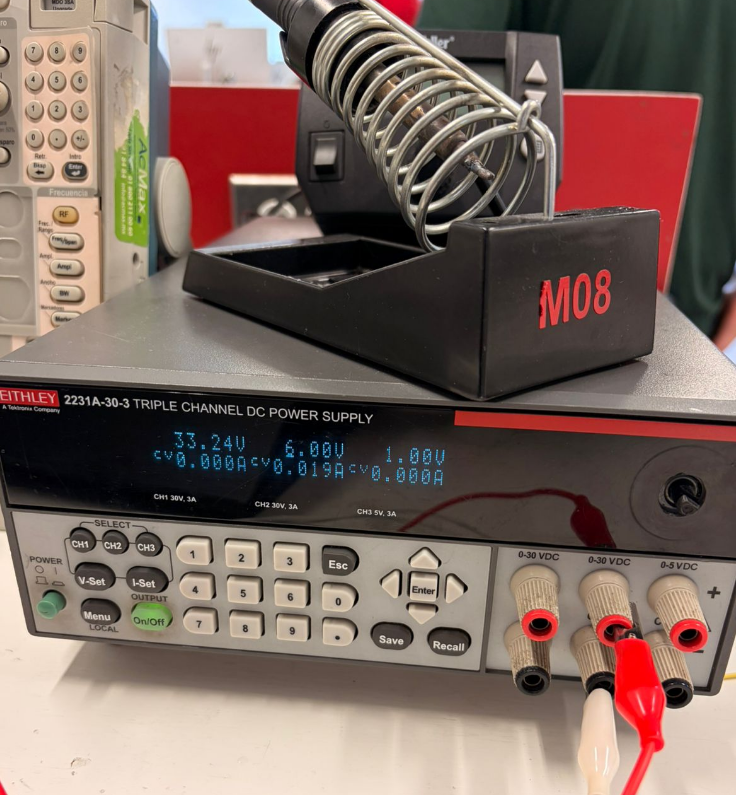

# Documentación del Proyecto

Bienvenido 👋  
Esta es una **plantilla** basada en [MkDocs](https://www.mkdocs.org/) + [Material for MkDocs](https://squidfunk.github.io/mkdocs-material/) para cursos y proyectos.


---

## Empezar rápido (3 pasos)

1. **Edita el nombre del sitio** en `mkdocs.yml`:
   ```yaml
   site_name: Documentación del Curso
   theme:
     name: material


Hola que tal me llamo Brandon Saul, esta es mi primer pagina decidi estudiar mecatronica porque me interesa mucho todo el tema electronico y principalmente la robotica me gusta hacer taekwondo y jugar videojuegos


 28 de agosto, En esta primera sesión comenzamos con algunos conceptos básicos de electrónica. Realizamos un circuito utilizando LEDs y resistencias, haciendo las conexiones en una protoboard. Después de probar el circuito, logramos que el LED parpadeara correctamente. También utilizamos un osciloscopio para observar la señal eléctrica de manera gráfica. Esto nos permitió ver cómo cambiaba la señal mientras el LED estaba funcionando y entender mejor lo que estaba pasando dentro del circuito.
     


circuito completo, Aprendí cómo conectar un LED junto con una resistencia y cómo hacer que un circuito produzca un parpadeo. También conocí el funcionamiento básico de un osciloscopio y cómo se puede utilizar para observar una señal eléctrica de forma gráfica. Esta práctica me ayudó a entender mejor cómo se comportan los componentes de un circuito cuando están conectados.
 


 4 de septiembre ESP32 y control de LED, En esta sesión trabajamos con el ESP32 para aprender a controlar diferentes componentes mediante programación. Primero conectamos un LED y logramos encenderlo desde el ESP32. Después utilizamos dos LEDs y conseguimos que parpadearan a diferentes tiempos.

.jpeg)
 En el código utilizamos pinMode() para indicar qué pines del ESP32 serían entradas y cuáles salidas. Con digitalRead() pudimos detectar el estado del botón y con digitalWrite() controlar los LEDs. También utilizamos Serial.println() para enviar información a la computadora y comprobar desde el monitor serial si el botón estaba siendo presionado.


Para la parte de Bluetooth utilizamos la librería BluetoothSerial. Esta permitió que el ESP32 recibiera mensajes desde el teléfono. Dependiendo de si recibía el comando "ON" o "OFF", el programa encendía o apagaba el LED correspondiente.
.jpeg)


También agregamos un botón al circuito para que el ESP32 pudiera detectar cuándo era presionado y cambiar el estado de los LEDs. Finalmente, probamos la comunicación entre el ESP32 y otros dispositivos, utilizando la computadora y el teléfono para enviar y recibir señales mediante Bluetooth.

Aprendí a utilizar las entradas y salidas del ESP32 para controlar componentes externos. También entendí cómo un botón puede enviar una señal al microcontrolador y cómo esa señal puede utilizarse para controlar un LED.


11 de septiembre En esta sesión trabajamos con Arduino y realizamos una simulación en Tinkercad para aprender a controlar motores. Utilizamos un puente H L293D para controlar dos motores DC y poder cambiar su sentido de giro. De esta manera logramos simular movimientos hacia adelante, atrás, derecha e izquierda.

También trabajamos con un servomotor, programándolo para que se moviera a diferentes posiciones. El código utilizó diferentes funciones para controlar cada dirección de los motores, cambiando los pines entre HIGH y LOW. Para el servomotor utilizamos la librería Servo.h y la función write() para indicarle los grados a los que debía colocarse.


Aprendí cómo funciona un puente H y cómo permite cambiar el sentido de giro de un motor DC dependiendo de las señales que recibe. También entendí que dos motores pueden combinarse para producir diferentes movimientos, como avanzar o girar. Además, aprendí a controlar la posición de un servomotor mediante Arduino y a utilizar código para coordinar diferentes componentes dentro de un mismo circuito.


